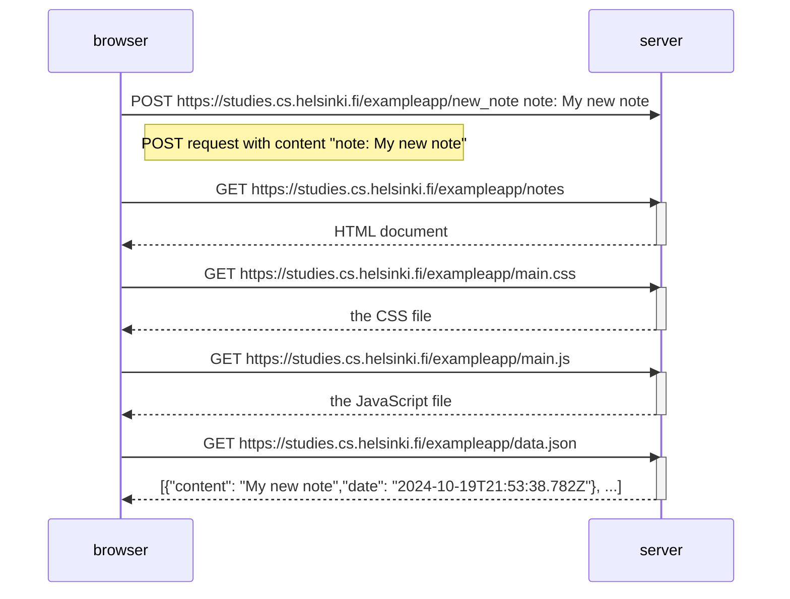

```mermaid
sequenceDiagram

    browser->>server: POST https://studies.cs.helsinki.fi/exampleapp/new_note note: My new note
    Note right of browser: POST request with content "note: My new note"


    browser->>server: GET https://studies.cs.helsinki.fi/exampleapp/notes
    activate server
    server-->>browser: HTML document
    deactivate server

    browser->>server: GET https://studies.cs.helsinki.fi/exampleapp/main.css
    activate server
    server-->>browser: the CSS file
    deactivate server

    browser->>server: GET https://studies.cs.helsinki.fi/exampleapp/main.js
    activate server
    server-->>browser: the JavaScript file
    deactivate server

    browser->>server: GET https://studies.cs.helsinki.fi/exampleapp/data.json
    activate server
    server-->>browser: [{"content": "My new note","date": "2024-10-19T21:53:38.782Z"}, ...]
    deactivate server
```
